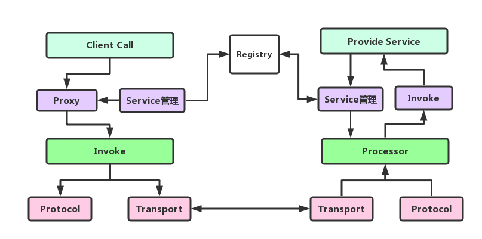

#### 1. RPC 结构拆解
RPC主要流程如下图：

RPC 服务提供者通过 Service Manager 发布到注册中心，同时暴露在本地。消费者通过Service Manager拉去服务的列表，并且保存至本地缓存。
客户方像调用本地方法一样去调用远程接口方法，RPC 框架提供接口的代理实现，实际的调用将委托给代理Proxy 。
代理封装调用信息并将调用转交给 Invoker 去实际执行。在客户端的Invoker 通过 Protocol 对调用信息编码协议消息，通过传输模块传送至服务提供方。

RPC 服务端接收器接收客户端的调用请求，同样使用 Protocol 执行协议解码。解码后的调用信息传递给 Processor去控制处理调用过程，最后再委托调用给 Invoker 去实际执行并返回调用结果。
#### 3. 协议
传输协议主要是为了解决粘包拆包问题，以及序列化的方式、工具的版本等问题。
```java
/**
 *  ┌ ─ ─ ─ ─ ─ ─ ─ ─ ─ ─ ─ ─ ─ ─ ─ ─ ─ ─ ─ ─ ─ ─ ─ ─ ─ ─ ─ ─ ─ ─ ─ ─ ─ ─ ─ ─ ─ ─ ─ ─ ─ ─ ─ ─ ─ ─ ─ ┐
 *       2   │   1   │    1   │     8     │      4      │
 *  ├ ─ ─ ─ ─ ─ ─ ─ ─ ─ ─ ─ ─ ─ ─ ─ ─ ─ ─ ─ ─ ─ ─ ─ ─ ─ ─ ─ ─ ─ ─ ─ ─ ─ ─ ─ ─ ─ ─ ─ ─ ─ ─ ─ ─ ─ ─ ─ ┤
 *           │       │        │           │             │
 *  │  MAGIC   Sign    Status   Invoke Id    Body Size                    Body Content              │
 *           │       │        │           │             │
 *  └ ─ ─ ─ ─ ─ ─ ─ ─ ─ ─ ─ ─ ─ ─ ─ ─ ─ ─ ─ ─ ─ ─ ─ ─ ─ ─ ─ ─ ─ ─ ─ ─ ─ ─ ─ ─ ─ ─ ─ ─ ─ ─ ─ ─ ─ ─ ─ ┘
 */
```
#### 4. 序列化

一般的序列化工具只能将对象序列化入byte数组或者原生ByteBuf中，但是这不利于基于Netty传输，因此我们借鉴ByteBufInputStream,
直接让FastJson/kryo将数据通过自定义的InputStream写入ByteBuf。并且自定义的InputStream可以复用。
#### 4. Client代理
如何做到对一个接口的调用？显然通过代理的方式，然而在Java中存在多种可以实现代理的方式，JDK提供的动态代理，CGlib动态代理，以及Javassist实现代理。
鉴于调用性能的考虑，默认采用的是使用Javassist的代理方式。说白了其实就是在内存中构建出了实现接口的实现类，在实现类中调用了ProxyInvoke的invoke方法。
参考了Dubbo的方式，对Invoke进行增加了InvokeChain,在InvokeChain中对调用增加逻辑上的处理。比如数据的统计，流量控制等。

#### 5. 传输
#### 6. 执行调用
1. 效率提升
   每个请求应该尽快被执行，因此我们不能每请求来再创建线程去执行，需要提供线程池服务。
2. 资源隔离
   当我们导出多个远程接口时，如何避免单一接口调用占据所有线程资源，而引发其他接口执行阻塞。
3. 超时控制
   当某个接口执行缓慢，而 client 端已经超时放弃等待后，server 端的线程继续执行此时显得毫无意义
